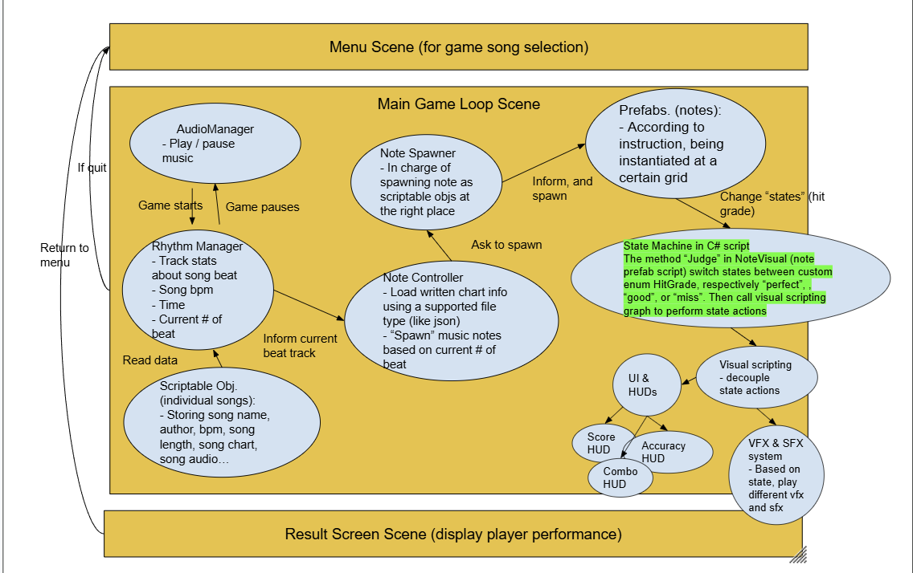

# GDIM33 Vertical Slice
## Milestone 1 Devlog
1. Currently I have one visual scripting graph attached on my GameManager gameObj. The graph intends to decouple the effect performance and UI update based on music note judgment (perfect, good, or miss). Specifically, after the state machine in my c# script NoteVisual evaluates the music note as one of the judgment type, it will call EventBus.trigger on the custom events I established in the graph. These custom events respectively contain "PerfectHit", "GoodHit", and "MissHit". These custom event in visual script each branches into their individual action and perform their individual effects. Currently when they operate, they would update the TextMeshProUGUI in the center of the screen and display the judgment result on screen. This is done by using the SetText node in TextMeshProUGUI option and assigning String Literal with either "Perfect!", "Good!", or "Miss!" to it, updating the UI element which I dragged in as an Object Variable.

2. 

I updated the break-down chart to specify the details of the state machine in my C# method Judge, contained in the script NoteVisual. Specifically, each time when the player attempts to tap the music note, the method EvaluateHit in RhythmManager is called and return a HitGrade result ("perfect", "good", or "miss"). This HitGrade result is then transfered to the Judge method mentioned previously, and the state machine switches its state based on the HitGrade. This is why in my break-down chart, I drew an arrow connecting the note prefab to the state machine, because the state machine logic would always performed in the script of a specific instance of note prefab. 

Then, the state machine alters and performs corresponding action by calling EventBus.trigger on their designated event to trigger in Visual Scripting decoupling graph, as described in question 1. The visual scripting would receive the call from state machine and perform the "visual juices" based on the state. This will include the UI update on the judgment result, a different SFX based on hit result, and a different color of VFX based on hit result, but these effects are still working in progress. As a result, the combination of c# state machine and visual scripting graph helps me clearly distinguish and decouple the relationship between complicated logics (the actual judgment and calculation) and the visual performance (the visual juices to execute based on result). This helps me a lot when comprehensing and visualizing my entire project. It's much more clear in imagining the functionalities of each part and I think the decoupling makes a lot of sense. 

## Milestone 2 Devlog
Milestone 2 Devlog goes here.
## Milestone 3 Devlog
Milestone 3 Devlog goes here.
## Milestone 4 Devlog
Milestone 4 Devlog goes here.
## Final Devlog
Final Devlog goes here.
## Open-source assets
- Cite any external assets used here!
