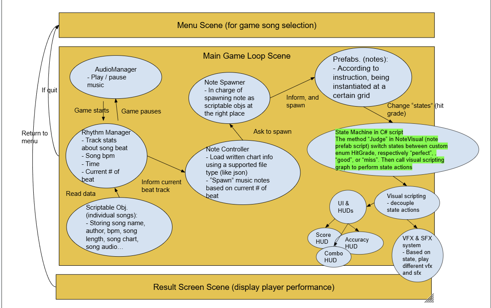
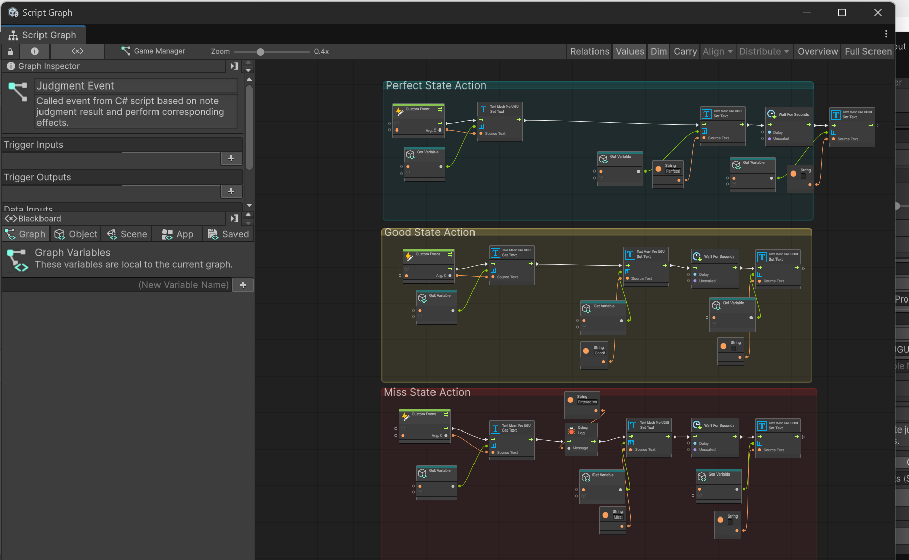
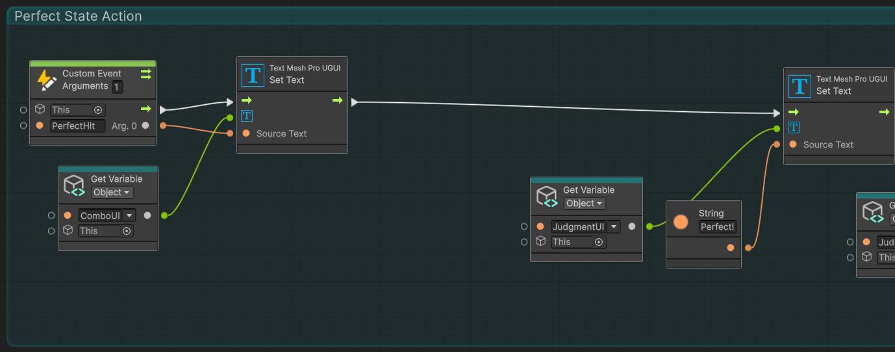
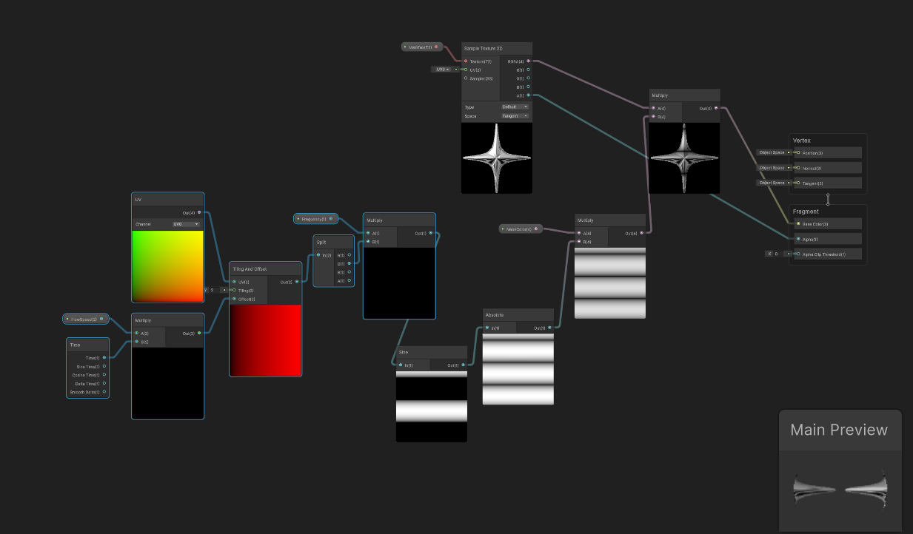

# GDIM33 Vertical Slice
## Milestone 1 Devlog
1. 
Currently I have one visual scripting graph attached on my GameManager gameObj. The graph intends to decouple the effect performance and UI update based on music note judgment (perfect, good, or miss). Specifically, after the state machine in my c# script NoteVisual evaluates the music note as one of the judgment type, it will call EventBus.trigger on the custom events I established in the graph. These custom events respectively contain "PerfectHit", "GoodHit", and "MissHit". These custom event in visual script each branches into their individual action and perform their individual effects. Currently when they operate, they would update the TextMeshProUGUI in the center of the screen and display the judgment result on screen. This is done by using the SetText node in TextMeshProUGUI option and assigning String Literal with either "Perfect!", "Good!", or "Miss!" to it, updating the UI element which I dragged in as an Object Variable.

2. 
I updated the break-down chart to specify the details of the state machine in my C# method Judge, contained in the script NoteVisual. Specifically, each time when the player attempts to tap the music note, the method EvaluateHit in RhythmManager is called and return a HitGrade result ("perfect", "good", or "miss"). This HitGrade result is then transfered to the Judge method mentioned previously, and the state machine switches its state based on the HitGrade. This is why in my break-down chart, I drew an arrow connecting the note prefab to the state machine, because the state machine logic would always performed in the script of a specific instance of note prefab. 

Then, the state machine alters and performs corresponding action by calling EventBus.trigger on their designated event to trigger in Visual Scripting decoupling graph, as described in question 1. The visual scripting would receive the call from state machine and perform the "visual juices" based on the state. This will include the UI update on the judgment result, a different SFX based on hit result, and a different color of VFX based on hit result, but these effects are still working in progress. As a result, the combination of c# state machine and visual scripting graph helps me clearly distinguish and decouple the relationship between complicated logics (the actual judgment and calculation) and the visual performance (the visual juices to execute based on result). This helps me a lot when comprehensing and visualizing my entire project. It's much more clear in imagining the functionalities of each part and I think the decoupling makes a lot of sense. 

## Milestone 2 Devlog
1. 
Complicating factor:
The central mechanic of my rhythm game centers around the logic of hitting music notes and correctly giving it a judge result according to how accurate the press timing is (player should click at the moment the golden star grows to the same size as the lane star). I have refined the logic so it works more correctly compared to milestone 1 -- the player's "too early" press now won't be judged as miss, which should prevent a lot of confusion around the judging. For this milestone, I specifically add more visual indication such as labeling the star with their designated keycode, and create the menu scene that demonstrate a minimal UI version of song selection menu as well as two other songs that showcase my usage of scriptable objects to manage individual song in this game. 

--- Task 1: Implementing Song Selection Menu ---

    1. Create a new scene named SongSelectionScene, outlining the basic GameObjects like UI and SceneManager in the hierarchy

    2. Establish a SceneManager script that handles the transition of scene to GamePlayScene 

    3. Create the scroller UI on the left-hand side of the screen that displays a list of scriptableObjects that represent each individual song. The scroller should be a list of scrollable objects with song names.

    4. Set-up the song detail panel on the right-hand side of the screen that display the details store in the scriptableObject when that individual song is selected (create a songSelectionManager to update the metadata to UI texts).

    5. Create prefab button that conduct the transition from SongSelectionScene to GamePlayScene while also passing the current song selected to the GameController.

--- Task 2: Polish UI, Visual Indication, and Features ---

    1. On each star lane in game, label them with their corresponding keyboard to strengthen the mental connection of lane and keyboard. Specifically, add a text label in the object container of each star sprite, adjusted with appropriate size that's both visible and not visually distracting.

    2. Search for fonts online and apply it in game to polish the visual. Cite the font in external assets (also cite the other components I have used).

    3. Implement the feature of pausing and restarting the game. Specifically, when "esc" or "p" is pressed, the time scale of the game should be toggled to either zero (paused) or one (unpaused); this will be a function in the GameController singleton. As for restarting, it will be another function that's called on "z" pressed and reload the scene. 

2.  
I think the breakdown is helpful for me in building this personal project because it gives me a clear and logical control on my to-dos rather than starting a new task from totally scratch, without pre-thinking about the entire procedure and knowing what will be done next. It also motivates me on my own tasks because I found myself to be low energy in doing works if I considered that task to be "super difficult" and "don't know where to start". Writing these steps down do help me to focus on the task while understanding my work and progress. Next time, I will narrow down the big step even more because the breakdown I wrote actually look like a "big big step" follow by several other "big steps" XD. However, I didn't dislike this too much because I would also be discouraged if the breakdown is too long and contains way too many steps. I don't think an improvement is in-demand, as I prefer to workout some of the tiny, intricated details as I craft through the logics rather than planning everything out thoroughly in advance. 

3.  
In my game, visual scripting graph is specified in tackling the visual effect performance. Specifically, it handles and fires a different visual indication to the player in response to a hit evaluation of "perfect", "good", or "hit". I've done this by calling custom node event in c# script NoteVisual in Judge method, where the state machine switches between these three state and call corresponding custom graph event node. The lines of code look like:

- GameController.Instance.triggerPerfectHit(); ->
- CustomEvent.Trigger(visualScriptingTarget, "PerfectHit", currentCombo.ToString());
- where visualScriptingTarget is the gameobject I placed the graph on, for c# script to correctly locate the graph. 

The graph is attached below, and the second image shows the "PerfectHit" custom event being referenced and called by the c# code listed above.

The later action of the branch performs the display of result onto the screen (updating the TMP text) and making it disappears after a delay of 1 second (where the coroutine node WaitForSeconds is used). In the future, the graph will also fires more visual effect and sound effect in response to the state received from c# script. 

4.  
I would like to be graded for the use of ScriptableObjects, which I used to store the metadata, images, audio, chart, and so on for each individual songs. I have implemented 2 of this song ScriptableObjects in game that can be seen in the song menu, where there's two song choices in the scroller that update its stored metadata to the right-hand panel when it's clicked. The gameplay is only available for "Infinite Heaven" though. 

## Milestone 3 Devlog
1.

The Shader Graph should be obvious. I tried to apply a scrolling liquid neon effect in the silver star lanes through manipulating and animating with UV. It took inspiration from how we achieved the fire shader animation during in-class activity. The central logic starts by connecting the "UV" node to a "tiling and offset" node, which allows me to play with the texture offset to create animation. Specifically, I use a multiplication of "time" node with a FlowSpeed (float) variable and attach it to the offset port, which makes the UV able to animate. Then, I used a "Split" node and acquire only the "G" value, which controls the vertical motion of the UV. The extracted "G" is multiplied with another variable Frequency, and all attach to the "sine" node to create the vertical flow effect. I then attach the outcome to an "absolute" node to make the animation smoother. Lastly, the animation effect is multiplied with the silver star texture to overlay the scrolling liquid neon visual. All these rgba then compose the final "fragment" color portion. This Shader Graph is finally made as material and applied through the six silver star lanes. 

2. 
Since my rhythm game mechanics is quite unique, I still didn't give up working on how the golden star note approaches. For this time, I made the golden star spins as it approaches and enlarges. Personally I think it strengthens the visual connection and did well in visual guiding (the star grows largest and is ready to be hitted as it aligns with the lane silver stars after spinning). 

3. 
Apart from this and the shader graph, I also implemented the full-screen global volume post-processing effect that is triggered when the player gets a perfect hit, creating a cinematic visual effect. Moreover, I made it possible for the player to adjust the offset of the gameplay, which is essential in rhythm game. It's adjusted at the menu page, and as the guidance says, negative offset means the audio to play earlier and positive offset means playing later. The note hit time are supposed to align with each 8th beat of the song. Feel free to test around! Press "P" or "Esc" to stop the gameplay at any moment; press "Z" to restart the gameplay; and press "Q" to return to the song selection menu, which allows you to again re-adjust the offset. 

## Final Devlog
1. 
The core gameplay loop is implemented completely as I illustrated in my breakdown chart: player begins from the song selection scene, chooses a song to play (currently only "Infinity Heaven" is playable; the other two songs from the menu are view-only), enters the gameplay, and finishes the gameplay with the judgment result scene displaying player's performance. The game chart "Infinity Heaven" has a length of 1m 30s and will have golden stars approaching at the lanes for player to "hit" them. Player should click the keyboard corresponds with that lane when the golden star right at the timing when it grows and spins completely. Supposedly, the hitting time should be every fourth beat of the song (if it feels off, try adjusting the offset!). The vertical slice is mainly displaying the main mechanics, or the "rhythm game" part of this game. For future content, the game will have more and more playable songs, more features, and more note type (more than tapping the keyboard?!). 

2. 
The rendering effect that is triggered during gameplay is the cinematic exposure screen effect activated when player hits a perfect. The effect is architected in the c# script VFXManager. In the script, the method TriggerPerfectFlash is used to set the intensity of Chromatic Aberration and Post Exposure in the Global Volume GameObject to achieve the cinematic flash screen display. The Update method in this script is used to lerp these value back to zero. As a result, by calling the TriggerPerfectFlash in GameController whenever a perfect hit is detected, the screen will display the full-screen post-processing effect of the cinematic flash, and the flash will fade / lerp out on its own. 

3. 
Personally, I am very into the process of breaking down a large project into specific systems and steps, as it helps me maintain a clear direction during development and also rescues me from procrastination and discouragement. Here's the plan I've followed when crafting this vertical slice: 

- Step 1: Brainstorming!
I think it's always essential to gather enough thoughts, ideas, and catches before starting a project. I found the moodboard we created at the very start of this class to be helpful in igniting my imagination and innovation. Jugging down all the cool ideas in mind and then find connections between them is definitely helpful for me when doing a creative project. 

- Step 2: Breaking Down the Core Mechanics
To start building the game, drawing the breakdown chart specifically for the core mechanics help a lot in concentrating my thought and direction. From the experience of creating minigames in 31, 32, and to this quarter-long project in 33, I am more persuaded to actually go beyond "planning in head" and actually draw out the breakdown chart. By reviewing the breakdown chart during the development process, it keeps my head clear about what to work on next, and which systems are more priortized in producing. 

- Step 3: Spliting Big Step into Small Steps
For me, this step doesn't necessary have to be a "plan ahead", but could happen only after I start working on that big step. However, it's still helpful for me to map out the small, achievable steps as to-do list during the process of production. By taking time to think through the next process in head and writing it out, it not only help making the goal visible and achivable, it also helps my problem of procrastination because the reason for procrastination is usually that the goal looks to far-away and exhausted to be done. This to-do list style practice helps me to concentrate better on working and gives me sense of accomplishment as works went on. 

- Step 4: Refine the Breakdown Chart
I found it nice to iteratively refine the breakdown chart during development. The breakdown chart is more than the pre-planning, but it is the architecture of the whole system and game that I'm visualing and working toward. For example, when developing my rhythm game, I actually have numerous instance of making the breakdown chart more concise, such as the time where I integrate all of the effects and performance of notes into a single system rather than overly spliting them; and there's also time where I have to breakdown a system furthermore because I didn't realize its complicatedness once I started working on it. As a result, refining this north-star chart has been helpful for me in navigating my project and progress. 

## Open-source assets
- [Starla Font from DaFont](https://www.dafont.com/starla.font)
- [Original Image of Star from Pinterest](https://www.pinterest.com/pin/872924340292062438/)
- [Songtrack - Infinity Heaven from Hyun](https://youtu.be/MPucvvz_fvE?si=3PKN9MxwW09mzjby)
- [Song Metadata and Images - Infinity Heaven](https://arcaea.fandom.com/wiki/Infinity_Heaven)
- [Song Metadata and Images - Tempestissmo](https://arcaea.fandom.com/wiki/Tempestissimo)
- [Song Metadata and Images - Aegleseeker](https://arcaea.fandom.com/wiki/Aegleseeker)
